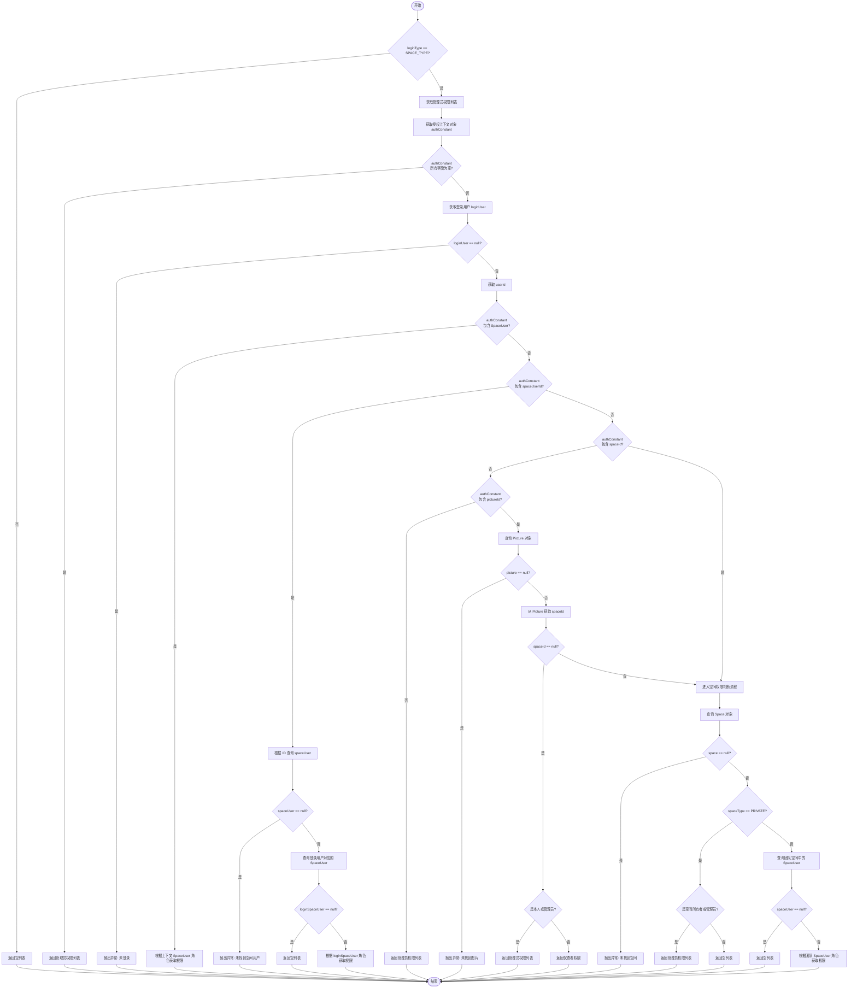

# 云图库后端

# 权限校验

```mermaid
flowchart TD
    Start([开始]) --> CheckLoginType{loginType == SPACE_TYPE?}
    
    CheckLoginType -- 否 --> ReturnEmpty1[返回空列表]
    CheckLoginType -- 是 --> GetAdminPerms[获取管理员权限列表]
    
    GetAdminPerms --> GetAuthContext[获取授权上下文对象 authConstant]
    GetAuthContext --> CheckAllNull{authConstant<br>所有字段为空?}
    
    CheckAllNull -- 是 --> ReturnAdminPerms1[返回管理员权限列表]
    CheckAllNull -- 否 --> GetLoginUser[获取登录用户 loginUser]
    
    GetLoginUser --> CheckLoginUser{loginUser == null?}
    CheckLoginUser -- 是 --> ThrowNotLogin[抛出异常: 未登录]
    CheckLoginUser -- 否 --> GetUserId[获取 userId]
    
    GetUserId --> CheckSpaceUserInContext{authConstant<br>包含 SpaceUser?}
    
    CheckSpaceUserInContext -- 是 --> GetPermsByContextUser[根据上下文 SpaceUser 角色获取权限]
    CheckSpaceUserInContext -- 否 --> CheckSpaceUserId{authConstant<br>包含 spaceUserId?}
    
    CheckSpaceUserId -- 是 --> GetSpaceUserById[根据 ID 查询 spaceUser]
    GetSpaceUserById --> CheckSpaceUserNull{spaceUser == null?}
    CheckSpaceUserNull -- 是 --> ThrowSpaceUserNotFound[抛出异常: 未找到空间用户]
    CheckSpaceUserNull -- 否 --> QueryLoginSpaceUser[查询登录用户对应的 SpaceUser]
    
    QueryLoginSpaceUser --> CheckLoginSpaceUserNull{loginSpaceUser == null?}
    CheckLoginSpaceUserNull -- 是 --> ReturnEmpty2[返回空列表]
    CheckLoginSpaceUserNull -- 否 --> GetPermsByLoginSpaceUser[根据 loginSpaceUser 角色获取权限]
    
    CheckSpaceUserId -- 否 --> CheckSpaceId{authConstant<br>包含 spaceId?}
    
    CheckSpaceId -- 否 --> CheckPictureId{authConstant<br>包含 pictureId?}
    CheckPictureId -- 否 --> ReturnAdminPerms2[返回管理员权限列表]
    
    CheckPictureId -- 是 --> GetPicture[查询 Picture 对象]
    GetPicture --> CheckPictureNull{picture == null?}
    CheckPictureNull -- 是 --> ThrowPictureNotFound[抛出异常: 未找到图片]
    CheckPictureNull -- 否 --> GetSpaceIdFromPic[从 Picture 获取 spaceId]
    
    GetSpaceIdFromPic --> CheckPicSpaceNull{spaceId == null?}
    CheckPicSpaceNull -- 是 --> CheckPicOwner{是本人或管理员?}
    CheckPicOwner -- 是 --> ReturnAdminPerms3[返回管理员权限列表]
    CheckPicOwner -- 否 --> ReturnViewPerm[返回仅查看权限]
    
    CheckPicSpaceNull -- 否 --> JoinSpaceFlow[进入空间权限判断流程]
    CheckSpaceId -- 是 --> JoinSpaceFlow
    
    JoinSpaceFlow --> GetSpace[查询 Space 对象]
    GetSpace --> CheckSpaceNull{space == null?}
    CheckSpaceNull -- 是 --> ThrowSpaceNotFound[抛出异常: 未找到空间]
    CheckSpaceNull -- 否 --> CheckSpaceType{spaceType == PRIVATE?}
    
    CheckSpaceType -- 是 --> CheckPrivateOwner{是空间所有者或管理员?}
    CheckPrivateOwner -- 是 --> ReturnAdminPerms4[返回管理员权限列表]
    CheckPrivateOwner -- 否 --> ReturnEmpty3[返回空列表]
    
    CheckSpaceType -- 否 --> QueryTeamSpaceUser[查询团队空间中的 SpaceUser]
    QueryTeamSpaceUser --> CheckTeamUserNull{spaceUser == null?}
    CheckTeamUserNull -- 是 --> ReturnEmpty4[返回空列表]
    CheckTeamUserNull -- 否 --> GetPermsByTeamUser[根据团队 SpaceUser 角色获取权限]
    
    %% 结束节点
    ReturnEmpty1 --> End([结束])
    ReturnAdminPerms1 --> End
    ThrowNotLogin --> End
    GetPermsByContextUser --> End
    ThrowSpaceUserNotFound --> End
    ReturnEmpty2 --> End
    GetPermsByLoginSpaceUser --> End
    ReturnAdminPerms2 --> End
    ThrowPictureNotFound --> End
    ReturnAdminPerms3 --> End
    ReturnViewPerm --> End
    ThrowSpaceNotFound --> End
    ReturnAdminPerms4 --> End
    ReturnEmpty3 --> End
    ReturnEmpty4 --> End
    GetPermsByTeamUser --> End


```